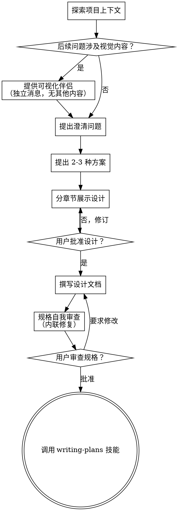

# 将想法孕育为设计

通过自然的协作对话，帮助将想法转化为完整的设计和规格说明。

首先了解当前项目上下文，然后逐一提问以 refine 想法。一旦你理解了要构建的内容，展示设计并获取用户批准。

<HARD-GATE>
在你展示设计并获得用户批准之前，**不得**调用任何实现技能、编写任何代码、搭建任何项目框架或采取任何实现行动。无论项目看起来多么"简单"，这条规则都适用。
</HARD-GATE>

## 反面模式："这太简单了，不需要设计"

每个项目都要走这个流程。待办列表、单函数工具、配置修改——无一例外。"简单"项目恰恰是最容易因为未经验证的假设而浪费最多工作的地方。设计可以很短（真正简单的项目几句话就够了），但你 **必须** 展示它并获得批准。

## 检查清单

你必须为以下每一项创建任务，并按顺序完成：

1. **探索项目上下文** —— 检查文件、文档、近期提交
2. **提供可视化伴侣**（如果话题涉及视觉问题）—— 这是一条独立的消息，不与澄清问题合并。见下方"可视化伴侣"章节。
3. **提出澄清问题** —— 一次一个，理解目的 / 约束 / 成功标准
4. **提出 2-3 种方案** —— 附带权衡分析和你的推荐
5. **展示设计** —— 按复杂度拆分为若干章节，每章节获取用户批准
6. **撰写设计文档** —— 保存至 `docs/specs/YYYY-MM-DD-<topic>-design.md` 并提交
7. **规格自我审查** —— 快速检查占位符、矛盾、歧义、范围（见下方）
8. **用户审查书面规格** —— 在继续之前请用户审查规格文件
9. **过渡到实现** —— 调用 writing-plans 技能创建实现计划

## 流程

**终端状态是调用 writing-plans。** 不得调用 frontend-design、mcp-builder 或任何其他实现技能。brainstorming 之后唯一能调用的技能只有 writing-plans。

## 流程详解

**理解想法：**

- 首先检查当前项目状态（文件、文档、近期提交）
- 在深入细节提问之前，先评估范围：如果需求描述了多个独立子系统（例如"构建一个包含聊天、文件存储、计费和数据分析的平台"），立即指出这一点。不要在一个需要拆解的项目上浪费时间细化细节。
- 如果项目太大，无法用单一规格覆盖，帮助用户拆解为子项目：有哪些独立的部分？它们之间如何关联？应该按什么顺序构建？然后按正常设计流程对第一个子项目进行头脑风暴。每个子项目都有自己的规格 → 计划 → 实现周期。
- 对于范围适当的项目，逐一提问以 refine 想法
- 尽量使用多选题，但开放式问题也可以
- 每条消息只提一个问题——如果某个话题需要更多探索，拆成多个问题
- 重点关注理解：目的、约束、成功标准

**探索方案：**

- 提出 2-3 种不同方案，附带权衡分析
- 以对话方式呈现选项，包含你的推荐和理由
- 先给出你推荐的选项并解释原因

**展示设计：**

- 当你确信自己理解了要构建的内容后，展示设计
- 每章节的篇幅应与复杂度匹配：直截了当的几句话， nuanced 的部分可达 200-300 字
- 每章节后询问用户目前看起来是否正确
- 涵盖：架构、组件、数据流、错误处理、测试
- 如果有什么地方说不通，随时准备回去澄清

**隔离性与清晰度的设计：**

- 将系统拆分为更小的单元，每个单元有单一明确的目的，通过定义良好的接口通信，可以被独立理解和测试
- 对于每个单元，你应该能够回答：它做什么？如何使用它？它依赖什么？
- 别人能否在不阅读内部实现的情况下理解一个单元的作用？你能否在不破坏消费者的情况下修改内部实现？如果不能，说明边界还需要调整。
- 更小、边界清晰的单元也更容易让你自己处理——你对能一次性装进上下文的代码推理能力更好，当文件聚焦时你的编辑也更可靠。当文件变得过大时，这通常意味着它承担了太多职责。

**在现有代码库中工作：**

- 在提出改动之前先探索当前结构。遵循现有模式。
- 当现有代码存在影响当前工作的问题时（例如文件过大、边界不清、职责混乱），在设计中包含有针对性的改进——就像优秀的开发者在修改代码时会做的那样。
- 不要提议与当前目标无关的重构。专注于服务于当前目标的内容。

## 设计之后

**文档：**

- 将已验证的设计（规格）写入 `docs/specs/YYYY-MM-DD-<topic>-design.md`
  - （用户对规格位置的偏好覆盖此默认值）
- 如有可用，使用 elements-of-style:writing-clearly-and-concisely 技能
- 将设计文档提交到 git

**规格自我审查：**
写完规格文档后，以全新的眼光审视它：

1. **占位符扫描：** 是否有 "TBD"、"TODO"、未完成的章节或模糊的需求？修复它们。
2. **内部一致性：** 各章节之间是否存在矛盾？架构是否与功能描述匹配？
3. **范围检查：** 这是否足够聚焦以纳入单一实现计划，还是需要拆解？
4. **歧义检查：** 是否有任何需求可以被两种不同方式解读？如果是，选定一种并明确化。

内联修复所有问题。无需重新审查——修完就继续。

**用户审查关卡：**
规格审查循环通过后，请用户在继续之前审查书面规格：

> "规格已撰写并提交至 `<path>`。请在开始编写实现计划之前审查它，告诉我是否需要做任何修改。"

等待用户回复。如果用户要求修改，进行修改并重新运行规格审查循环。只有在用户批准后才能继续。

**实现：**

- 调用 writing-plans 技能创建详细的实现计划
- 不得调用任何其他技能。writing-plans 是下一步。

## 核心原则

- **一次一个问题** —— 不要用多个问题轰炸用户
- **多选优先** —— 在可能的情况下比开放式更容易回答
- **严格遵循 YAGNI** —— 从所有设计中剔除不必要的功能
- **探索替代方案** —— 在定案前始终提出 2-3 种方案
- **增量验证** —— 展示设计，在继续前获取批准
- **保持灵活** —— 当有什么说不通时，回去澄清

## 可视化伴侣

一个基于浏览器的伴侣工具，用于在头脑风暴期间展示模型、图表和视觉选项。它是一项工具，而非一种模式。接受伴侣意味着它可用于那些从视觉处理中受益的问题；这 **不** 意味着每个问题都要通过浏览器进行。

**提供伴侣：** 当你预期 upcoming 的问题会涉及视觉内容（模型、布局、图表）时，提供一次征询同意：
> "我们正在处理的一些内容，如果我在网页浏览器中展示给你看，可能会更容易解释。我可以随着进度提供模型、图表、对比和其他视觉内容。这个功能还比较新，可能会消耗较多 token。想试试吗？（需要打开一个本地 URL）"

**此提供必须是它自己的一条消息。** 不得将其与澄清问题、上下文摘要或任何其他内容合并。消息中 **只** 包含上面的提供内容，没有其他任何内容。等待用户回复后再继续。如果用户拒绝，则继续进行纯文本头脑风暴。

**逐问题决策：** 即使用户接受了，也要 **针对每个问题** 决定是使用浏览器还是终端。判断标准：**用户看到它是否比读到它更容易理解？**

- **使用浏览器** 处理 **视觉性** 内容——模型、线框图、布局对比、架构图、并排视觉设计
- **使用终端** 处理 **文本性** 内容——需求问题、概念选择、权衡列表、A/B/C/D 文本选项、范围决策

关于 UI 话题的问题不一定是视觉问题。"在这里'个性'意味着什么？"是一个概念问题——用终端。"哪个向导布局更好？"是一个视觉问题——用浏览器。

如果用户同意使用伴侣，在继续之前阅读详细指南：
`skills/brainstorming/visual-companion.md`

---

*本技能源自 Obra 的 Superpowers，为 MySuperPowers 进行了适配。*
