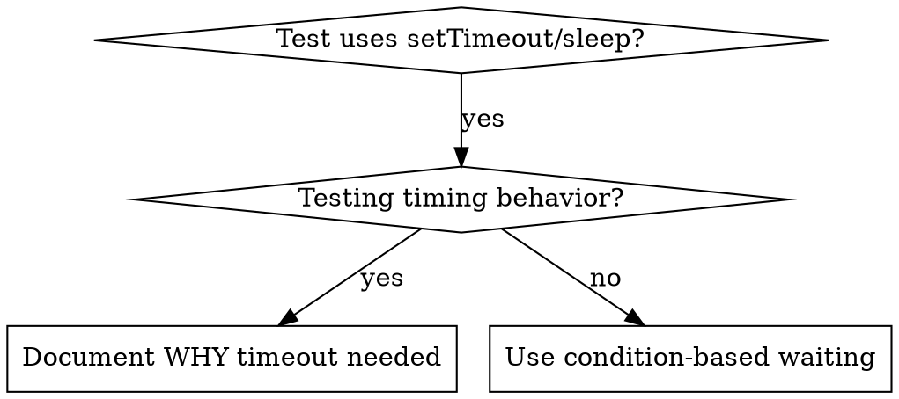

# 基于条件的等待

## 概述

不稳定测试常使用任意延迟猜测时机，这会导致竞态条件：测试在性能好的机器上通过，但在高负载或 CI 环境中失败。

**核心原则：** 等待你关心的实际条件，而非猜测需要多长时间。

## 适用场景



**适用情况：**
- 测试包含任意延迟（`setTimeout`、`sleep`、`time.sleep()`）
- 测试不稳定（有时通过，高负载下失败）
- 并行运行时测试超时
- 等待异步操作完成

**不适用情况：**
- 测试实际时序行为（防抖、节流间隔）
- 若使用任意超时，务必注明原因

## 核心模式

```typescript
// ❌ BEFORE: Guessing at timing
await new Promise(r => setTimeout(r, 50));
const result = getResult();
expect(result).toBeDefined();

// ✅ AFTER: Waiting for condition
await waitFor(() => getResult() !== undefined);
const result = getResult();
expect(result).toBeDefined();
```

## 快速模式

| 场景 | 模式 |
|----------|---------|
| Wait for event | `waitFor(() => events.find(e => e.type === 'DONE'))` |
| Wait for state | `waitFor(() => machine.state === 'ready')` |
| Wait for count | `waitFor(() => items.length >= 5)` |
| Wait for file | `waitFor(() => fs.existsSync(path))` |
| Complex condition | `waitFor(() => obj.ready && obj.value > 10)` |

## 实现

通用轮询函数：
```typescript
async function waitFor<T>(
  condition: () => T | undefined | null | false,
  description: string,
  timeoutMs = 5000
): Promise<T> {
  const startTime = Date.now();

  while (true) {
    const result = condition();
    if (result) return result;

    if (Date.now() - startTime > timeoutMs) {
      throw new Error(`Timeout waiting for ${description} after ${timeoutMs}ms`);
    }

    await new Promise(r => setTimeout(r, 10)); // Poll every 10ms
  }
}
```

本目录下的 `condition-based-waiting-example.ts` 包含完整实现，以及来自实际调试会话的领域特定辅助函数（`waitForEvent`、`waitForEventCount`、`waitForEventMatch`），可供参考。

## 常见错误

**❌ 轮询过快：** `setTimeout(check, 1)` - 浪费 CPU
**✅ 修复：** 每 10ms 轮询一次

**❌ 无超时：** 条件不满足时会无限循环
**✅ 修复：** 始终包含超时并给出明确错误

**❌ 数据过期：** 循环前缓存状态
**✅ 修复：** 在循环内调用 getter 获取最新数据

## 何时任意超时是合理的

```typescript
// Tool ticks every 100ms - need 2 ticks to verify partial output
await waitForEvent(manager, 'TOOL_STARTED'); // First: wait for condition
await new Promise(r => setTimeout(r, 200));   // Then: wait for timed behavior
// 200ms = 2 ticks at 100ms intervals - documented and justified
```

**要求：**
1. 首先等待触发条件
2. 基于已知时序（而非猜测）
3. 添加注释说明原因

## 实际效果

来自 2025-10-03 的调试会话：
- 修复了3个文件中的15个不稳定测试
- 通过率：60% → 100%
- 执行时间：缩短40%
- 不再有竞态条件
