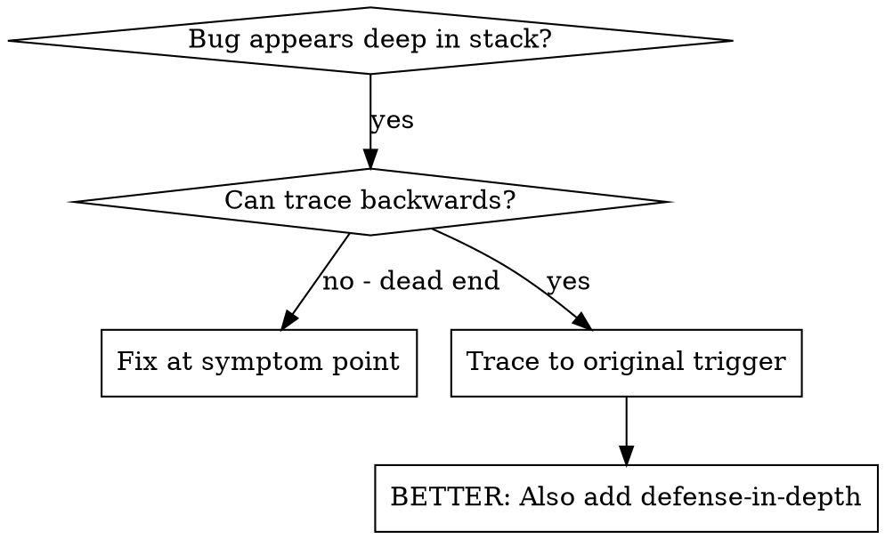
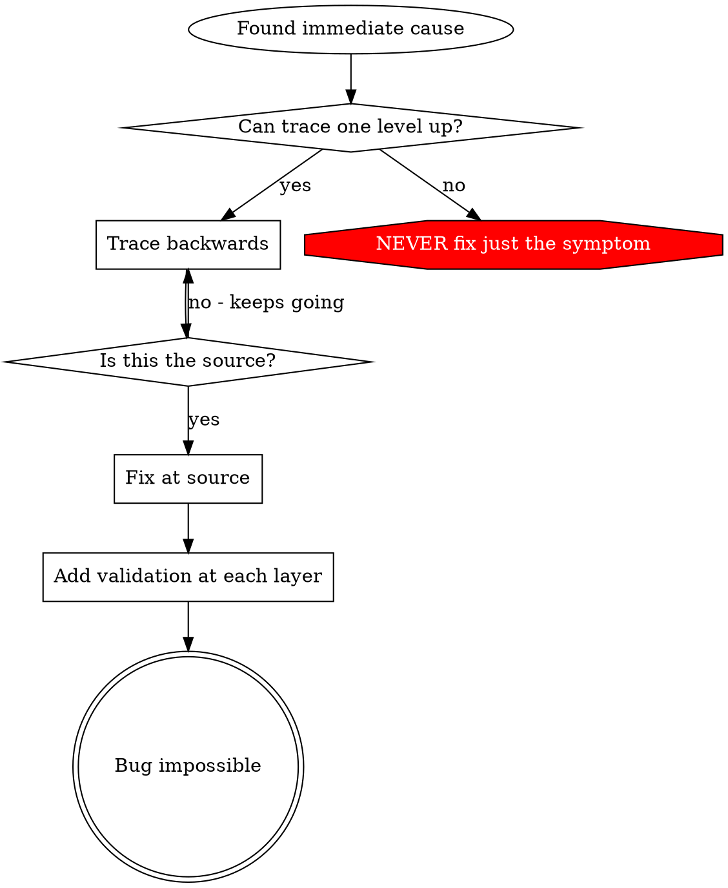

# 根因追溯

## 概述

缺陷往往出现在调用栈的深处（比如在错误目录执行 git init、在错误位置创建文件、用错误路径打开数据库）。你的本能是在错误出现的地方修复，但这只是治标。

**核心原则：** 沿调用链向后追溯，直到找到原始触发点，再从源头修复。

## 适用场景



**适用情况：**
- 错误发生在执行深处（而非入口点）
- 堆栈跟踪显示长调用链
- 无法明确无效数据的来源
- 需要找到触发问题的测试/代码

## 追溯流程

### 1. 观察症状
```
Error: git init failed in ~/project/packages/core
```

### 2. 找到直接原因
**哪段代码直接导致了这个问题？**
```typescript
await execFileAsync('git', ['init'], { cwd: projectDir });
```

### 3. 追问：谁调用了这段代码？
```typescript
WorktreeManager.createSessionWorktree(projectDir, sessionId)
  → called by Session.initializeWorkspace()
  → called by Session.create()
  → called by test at Project.create()
```

### 4. 继续向上追溯
**传入了什么值？**
- `projectDir = ''`（空字符串！）
- 空字符串作为 `cwd` 会解析为 `process.cwd()`
- 那就是源代码目录！

### 5. 找到原始触发点
**空字符串来自哪里？**
```typescript
const context = setupCoreTest(); // Returns { tempDir: '' }
Project.create('name', context.tempDir); // Accessed before beforeEach!
```

## 添加堆栈跟踪

无法手动追溯时，添加埋点：

```typescript
// Before the problematic operation
async function gitInit(directory: string) {
  const stack = new Error().stack;
  console.error('DEBUG git init:', {
    directory,
    cwd: process.cwd(),
    nodeEnv: process.env.NODE_ENV,
    stack,
  });

  await execFileAsync('git', ['init'], { cwd: directory });
}
```

**关键：** 测试中使用 `console.error()`（不要用 logger，可能不会输出）

**运行并捕获：**
```bash
npm test 2>&1 | grep 'DEBUG git init'
```

**分析堆栈跟踪：**
- 查找测试文件名
- 找到触发调用的行号
- 识别模式（同一个测试？同一个参数？）

## 定位导致污染的测试

如果测试过程中出现异常情况，但不知道是哪个测试导致的：

使用本目录下的二分查找脚本 `find-polluter.sh`：

```bash
./find-polluter.sh '.git' 'src/**/*.test.ts'
```

逐个运行测试，在第一个污染源处停止。使用方法见脚本说明。

## 真实案例：空的 projectDir

**症状：** 在 `packages/core/`（源代码目录）创建了 `.git`

**追溯链：**
1. `git init` 在 `process.cwd()` 中执行 ← cwd 参数为空
2. WorktreeManager 被传入空的 projectDir 调用
3. Session.create() 传入了空字符串
4. 测试在 beforeEach 之前访问了 `context.tempDir`
5. setupCoreTest() 初始返回 `{ tempDir: '' }`

**根因：** 顶层变量初始化时访问了空值

**修复：** 将 tempDir 改为 getter，若在 beforeEach 之前访问则抛出异常

**同时添加了纵深防御：**
- 第1层：Project.create() 验证目录
- 第2层：WorkspaceManager 验证非空
- 第3层：NODE_ENV 守卫拒绝在 tmpdir 外执行 git init
- 第4层：git init 前记录堆栈跟踪

## 核心原则



**绝不要只在错误出现的地方修复。向后追溯找到原始触发点。**

## 堆栈跟踪技巧

**测试中：** 使用 `console.error()` 而非 logger，logger 可能被抑制
**操作前：** 在危险操作前记录，而非失败后
**包含上下文：** 目录、cwd、环境变量、时间戳
**捕获堆栈：** `new Error().stack` 会显示完整调用链

## 实际效果

来自 2025-10-03 的调试会话：
- 通过5层追溯找到根因
- 从源头修复（getter 验证）
- 添加4层防御
- 1847 个测试全部通过，无污染
