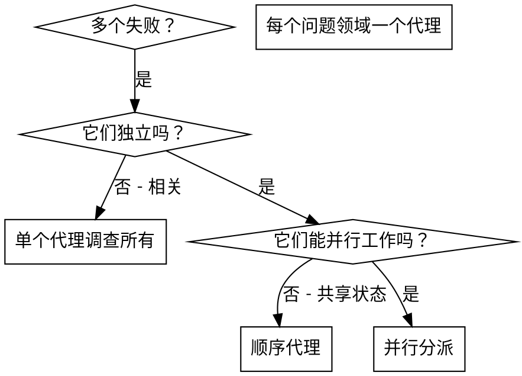

# 并行代理分派（Dispatching Parallel Agents）

## 概述

你将任务委托给具有隔离上下文的专用代理。通过精确构建它们的指令和上下文，你确保它们保持专注并成功完成任务。它们绝不应该继承你会话的上下文或历史——你构建它们恰好需要的东西。这也为你自己的协调工作保留了上下文。

当你有多个不相关的失败（不同的测试文件、不同的子系统、不同的 Bug）时，顺序调查它们浪费时间。每次调查都是独立的，可以并行进行。

**核心原则：** 为每个独立问题领域分派一个代理。让它们同时工作。

## 何时使用



**使用场景：**
- 3+ 个测试文件因不同根因而失败
- 多个子系统独立损坏
- 每个问题都可以在没有其他问题上下文的情况下被理解
- 调查之间无共享状态

**不使用场景：**
- 失败相关（修复一个可能修复其他）
- 需要理解完整系统状态
- 代理会互相干扰

## 模式

### 1. 识别独立领域

按损坏的内容对失败分组：
- 文件 A 测试：工具审批流
- 文件 B 测试：批处理完成行为
- 文件 C 测试：中止功能

每个领域是独立的——修复工具审批不影响中止测试。

### 2. 创建聚焦的代理任务

每个代理获得：
- **具体范围：** 一个测试文件或子系统
- **清晰目标：** 让这些测试通过
- **约束：** 不要更改其他代码
- **预期输出：** 你发现并修复的内容摘要

### 3. 并行分派

```typescript
// 在 Claude Code / AI 环境中
Task("Fix agent-tool-abort.test.ts failures")
Task("Fix batch-completion-behavior.test.ts failures")
Task("Fix tool-approval-race-conditions.test.ts failures")
// 三个同时运行
```

### 4. 审查和整合

当代理返回时：
- 阅读每个摘要
- 验证修复不冲突
- 运行完整测试套件
- 整合所有变更

## 代理提示结构

好的代理提示是：
1. **聚焦的** —— 一个清晰的问题领域
2. **自包含的** —— 理解问题所需的所有上下文
3. **关于输出具体明确的** —— 代理应该返回什么？

```markdown
Fix the 3 failing tests in src/agents/agent-tool-abort.test.ts:

1. "should abort tool with partial output capture" - expects 'interrupted at' in message
2. "should handle mixed completed and aborted tools" - fast tool aborted instead of completed
3. "should properly track pendingToolCount" - expects 3 results but gets 0

These are timing/race condition issues. Your task:

1. Read the test file and understand what each test verifies
2. Identify root cause - timing issues or actual bugs?
3. Fix by:
   - Replacing arbitrary timeouts with event-based waiting
   - Fixing bugs in abort implementation if found
   - Adjusting test expectations if testing changed behavior

Do NOT just increase timeouts - find the real issue.

Return: Summary of what you found and what you fixed.
```

## 常见错误

**❌ 太宽泛：** "Fix all the tests" —— 代理迷失
**✅ 具体：** "Fix agent-tool-abort.test.ts" —— 聚焦范围

**❌ 无上下文：** "Fix the race condition" —— 代理不知道在哪里
**✅ 上下文：** 粘贴错误信息和测试名称

**❌ 无约束：** 代理可能重构一切
**✅ 约束：** "Do NOT change production code" 或 "Fix tests only"

**❌ 模糊输出：** "Fix it" —— 你不知道改了什么
**✅ 具体：** "Return summary of root cause and changes"

## 何时不使用

**相关失败：** 修复一个可能修复其他——先一起调查
**需要完整上下文：** 理解需要看到整个系统
**探索性调试：** 你还不知道哪里坏了
**共享状态：** 代理会互相干扰（编辑相同文件、使用相同资源）

## 真实会话示例

**场景：** 重大重构后 3 个文件 6 个测试失败

**失败：**
- agent-tool-abort.test.ts: 3 个失败（时序问题）
- batch-completion-behavior.test.ts: 2 个失败（工具未执行）
- tool-approval-race-conditions.test.ts: 1 个失败（执行计数 = 0）

**决策：** 独立领域——中止逻辑独立于批处理完成独立于竞态条件

**分派：**
```
Agent 1 → Fix agent-tool-abort.test.ts
Agent 2 → Fix batch-completion-behavior.test.ts
Agent 3 → Fix tool-approval-race-conditions.test.ts
```

**结果：**
- Agent 1: 用基于事件的等待替换超时
- Agent 2: 修复了事件结构 Bug（threadId 放错位置）
- Agent 3: 添加了等待异步工具执行完成

**整合：** 所有修复独立，无冲突，全套件通过

**节省时间：** 3 个问题并行解决 vs 顺序解决

## 关键收益

1. **并行化** —— 多个调查同时发生
2. **聚焦** —— 每个代理有狭窄范围，更少上下文要跟踪
3. **独立性** —— 代理不互相干扰
4. **速度** —— 3 个问题在 1 个问题的时间内解决

## 验证

代理返回后：
1. **审查每个摘要** —— 理解改了什么
2. **检查冲突** —— 代理编辑了相同代码吗？
3. **运行完整套件** —— 验证所有修复一起工作
4. **抽查** —— 代理可能犯系统性错误

## 真实影响

来自调试会话（2025-10-03）：
- 3 个文件 6 个失败
- 3 个代理并行分派
- 所有调查并发完成
- 所有修复成功整合
- 代理变更之间零冲突

---

*本技能源自 Obra 的 Superpowers，为 MySuperPowers 进行了适配。*
