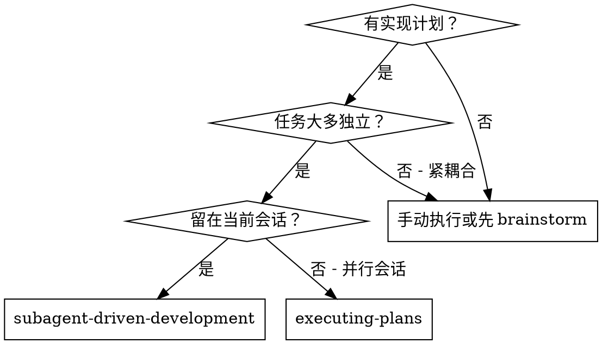
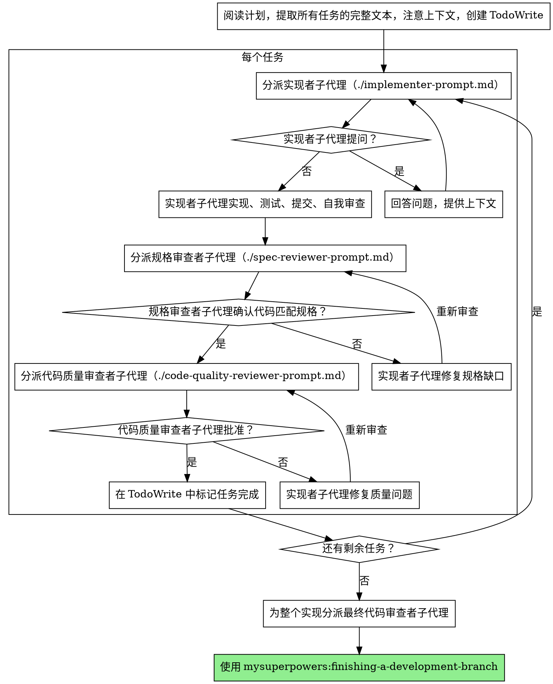

# 子代理驱动开发（Subagent-Driven Development）

通过为每个任务分派全新的子代理来执行计划，每个任务后进行两阶段审查：先审查规格合规性，再审查代码质量。

**为何使用子代理：** 你将任务委托给具有隔离上下文的专用代理。通过精确构建它们的指令和上下文，你确保它们保持专注并成功完成任务。它们绝不应该继承你会话的上下文或历史——你构建它们恰好需要的东西。这也为你自己的协调工作保留了上下文。

**核心原则：** 每个任务一个全新子代理 + 两阶段审查（先规格后质量）= 高质量，快速迭代

**持续执行：** 不要在任务之间暂停与你的用户伙伴确认。不间断地执行计划中的所有任务。唯一停止的理由是：你无法解决的 BLOCKED 状态、真正阻碍进展的歧义，或所有任务完成。"我应该继续吗？"的提示和进度摘要浪费他们的时间——他们要求你执行计划，所以执行它。

## 何时使用



**vs. 执行计划（并行会话）：**
- 同一会话（无上下文切换）
- 每个任务一个全新子代理（无上下文污染）
- 每个任务后两阶段审查：先规格合规性，再代码质量
- 更快迭代（任务之间无需人在环中）

## 流程



## 模型选择

使用能处理每个角色的最弱模型以节省成本并提高速度。

**机械实现任务**（隔离函数、明确规格、1-2 个文件）：使用快速、便宜的模型。大多数实现任务在计划规格良好时是机械性的。

**集成和判断任务**（多文件协调、模式匹配、调试）：使用标准模型。

**架构、设计和审查任务**：使用最强大的可用模型。

**任务复杂度信号：**
- 触碰 1-2 个文件且有完整规格——便宜模型
- 触碰多个文件且有集成问题——标准模型
- 需要设计判断或广泛代码库理解——最强大的模型

## 处理实现者状态

实现者子代理报告四种状态之一。适当地处理每种：

**DONE：** 进入规格合规性审查。

**DONE_WITH_CONCERNS：** 实现者完成了工作但标记了疑虑。在继续之前阅读这些疑虑。如果疑虑涉及正确性或范围，在审查之前解决它们。如果它们是观察（例如"这个文件变得很大"），记录它们并进入审查。

**NEEDS_CONTEXT：** 实现者需要未提供的信息。提供缺失的上下文并重新分派。

**BLOCKED：** 实现者无法完成任务。评估阻塞者：
1. 如果是上下文问题，提供更多上下文并用相同模型重新分派
2. 如果任务需要更多推理，用更强大的模型重新分派
3. 如果任务太大，将其拆分为更小的部分
4. 如果计划本身是错误的，升级给用户

**绝不** 忽略升级或强制相同模型在不变更的情况下重试。如果实现者说它卡住了，某件事需要改变。

## 提示模板

- `./implementer-prompt.md` —— 分派实现者子代理
- `./spec-reviewer-prompt.md` —— 分派规格合规性审查者子代理
- `./code-quality-reviewer-prompt.md` —— 分派代码质量审查者子代理

## 示例工作流

```
You: 我正在使用 Subagent-Driven Development 来执行此计划。

[阅读计划文件一次：docs/plans/feature_plan.md]
[提取所有 5 个任务的完整文本和上下文]
[用所有任务创建 TodoWrite]

任务 1：Hook 安装脚本

[获取任务 1 文本和上下文（已提取）]
[用完整任务文本 + 上下文分派实现子代理]

实现者："在开始之前——hook 应该安装在用户级还是系统级？"

You: "用户级（~/.config/mysuperpowers/hooks/）"

实现者："Got it. Implementing now..."
[稍后] 实现者:
  - 实现了 install-hook 命令
  - 添加了测试，5/5 通过
  - 自我审查：发现我遗漏了 --force 标志，添加了它
  - 已提交

[分派规格合规性审查者]
规格审查者: ✅ 规格合规 - 所有需求满足，无多余

[获取 git SHAs，分派代码质量审查者]
代码审查者: Strengths: Good test coverage, clean. Issues: None. Approved.

[标记任务 1 完成]

任务 2：恢复模式

[获取任务 2 文本和上下文（已提取）]
[用完整任务文本 + 上下文分派实现子代理]

实现者: [无提问，继续进行]
实现者:
  - 添加了 verify/repair 模式
  - 8/8 测试通过
  - 自我审查: All good
  - 已提交

[分派规格合规性审查者]
规格审查者: ⚠️ Issues:
  - 缺失：进度报告（规格说"每 100 项报告一次"）
  - 多余：添加了 --json 标志（未请求）

[实现者修复问题]
实现者: Removed --json flag, added progress reporting

[规格审查者再次审查]
规格审查者: ✅ 现在规格合规

[分派代码质量审查者]
代码审查者: Strengths: Solid. Issues (Important): Magic number (100)

[实现者修复]
实现者: Extracted PROGRESS_INTERVAL constant

[代码审查者再次审查]
代码审查者: ✅ Approved

[标记任务 2 完成]

...

[所有任务完成后]
[分派最终代码审查者]
最终审查者: All requirements met, ready to merge

Done!
```

## 优势

**vs. 手动执行：**
- 子代理自然地遵循 TDD
- 每个任务新鲜上下文（无混淆）
- 并行安全（子代理不互相干扰）
- 子代理可以提问（工作前和工作期间）

**vs. 执行计划：**
- 同一会话（无交接）
- 持续进展（无需等待）
- 自动审查检查点

**效率提升：**
- 无文件读取开销（控制器提供完整文本）
- 控制器精确策划所需上下文
- 子代理 upfront 获得完整信息
- 问题在工作开始前浮出水面（而非之后）

**质量关卡：**
- 自我审查在交接前捕获问题
- 两阶段审查：规格合规性，然后代码质量
- 审查循环确保修复真正有效
- 规格合规性防止过度 / 不足构建
- 代码质量确保实现构建良好

**成本：**
- 更多子代理调用（实现者 + 每个任务 2 个审查者）
- 控制器做更多准备工作（提前提取所有任务）
- 审查循环增加迭代
- 但早期捕获问题（比以后调试更便宜）

## 危险信号

**绝不：**
- 未经用户明确同意在 main/master 分支上开始实现
- 跳过审查（规格合规性或代码质量）
- 带着未修复的问题继续
- 并行分派多个实现子代理（冲突）
- 让子代理读取计划文件（提供完整文本代替）
- 跳过场景设定上下文（子代理需要理解任务在整体中的位置）
- 忽略子代理的问题（在让他们继续之前回答）
- 在规格合规性上接受"差不多"（规格审查者发现问题 = 未完成）
- 跳过审查循环（审查者发现问题 = 实现者修复 = 审查者再次审查）
- 让实现者自我审查替代实际审查（两者都需要）
- **在规格合规性完成 **之前** 开始代码质量审查**（顺序错误）
- 在任一审查有未决问题时移动到下一个任务

**如果子代理提问：**
- 清晰完整地回答
- 如果需要，提供额外上下文
- 不要催促它们进入实现

**如果审查者发现问题：**
- 实现者（同一个子代理）修复它们
- 审查者再次审查
- 重复直到批准
- 不要跳过重新审查

**如果子代理任务失败：**
- 分派修复子代理，附带具体指令
- 不要手动修复（上下文污染）

## 集成

**必需工作流技能：**
- **mysuperpowers:using-git-worktrees** —— 确保隔离的工作区（创建一个或验证已有的）
- **mysuperpowers:writing-plans** —— 创建此技能执行的计划
- **mysuperpowers:requesting-code-review** —— 用于审查者子代理的代码审查模板
- **mysuperpowers:finishing-a-development-branch** —— 所有任务完成后完成开发

**子代理应使用：**
- **mysuperpowers:tdd** —— 子代理对每个任务遵循 TDD

**替代工作流：**
- **mysuperpowers:executing-plans** —— 用于并行会话而非同会话执行

---

*本技能源自 Obra 的 Superpowers，为 MySuperPowers 进行了适配。*
